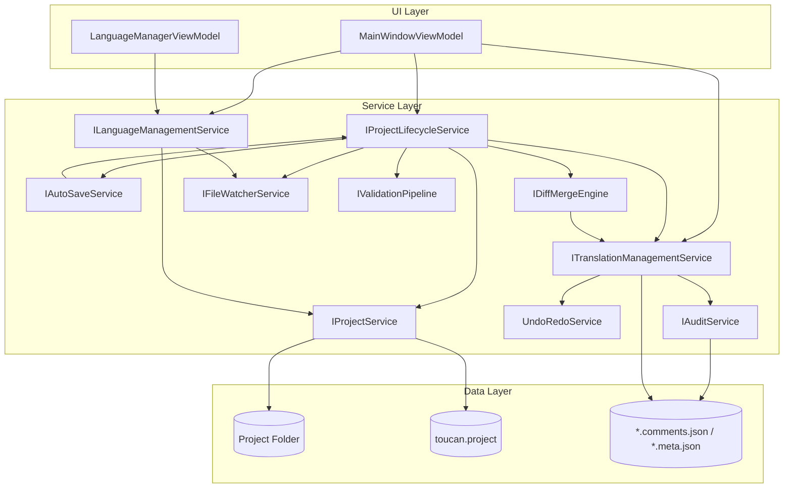

# Design Document: Project and Translation IO

## Overview

This design describes the unified IO layer for Toucan's project lifecycle and translation persistence. The core goal is to extract all data manipulation, file I/O, and change-tracking logic from ViewModel partial classes into well-defined, DI-registered services. This enables isolated unit testing, consistent behavior across all project entry points, and a clean separation between UI orchestration (ViewModels) and business logic (services).

The architecture introduces five new service interfaces and refactors two existing components:

| Component | Responsibility |
|-----------|---------------|
| `IProjectLifecycleService` | Orchestrates Open, Close, Save, Save As flows |
| `ITranslationManagementService` | In-memory collection, per-item dirty tracking, debounce |
| `ILanguageManagementService` | Language CRUD, disk cleanup, manifest sync |
| `IAutoSaveService` | Timer-based periodic persistence |
| `IDiffMergeEngine` | Three-way diff and conflict resolution |
| `IFileWatcherService` (refactor) | File monitoring behind an interface |
| `IProjectService` (extend) | Core load/save with lifecycle methods |

All new services are registered as singletons (they hold project-scoped state or subscriptions) in the existing `Microsoft.Extensions.DependencyInjection` container configured in `App.xaml.cs`.

## Architecture



### Design Decisions

1. **Single load pipeline**: All open paths (folder picker, file picker, recent, new project) converge at `IProjectLifecycleService.OpenProjectAsync(string folderPath)`. This eliminates duplicated load logic across 4+ call sites in `MainWindowViewModel.File.cs`.

2. **Per-item dirty tracking with baseline comparison**: Rather than a simple boolean flag, each `TranslationItem` gets a `LastSavedValue` and `LastSavedComment` baseline stored in the tracker. An item is dirty when its current value differs from its baseline. This naturally handles undo-to-clean scenarios.

3. **Debounce at the service level**: The 500ms (value edits) / 300ms (write coordination) debounce moves from implicit ViewModel behavior to explicit `ITranslationManagementService` responsibility. This uses a per-item `System.Threading.Timer` or a batched approach.

4. **Auto-save as a separate service**: `IAutoSaveService` owns its own `System.Threading.Timer` and delegates actual persistence to `IProjectLifecycleService.SaveProjectAsync()`. This keeps the timer lifecycle isolated from save logic.

5. **Three-way merge on composite key**: The diff engine matches items by `(Language, Namespace)` — the natural composite key already used throughout Toucan. The "base" is the last-saved snapshot maintained by `ITranslationManagementService`.

6. **Sidecar files for format-agnostic metadata**: Comments (for formats without inline support) and audit metadata are stored in JSON sidecar files alongside translation files. This avoids format-specific serialization complexity.

## Components and Interfaces

### IProjectLifecycleService

```csharp
public interface IProjectLifecycleService
{
    /// <summary>Opens a project from any entry point. Handles unsaved-changes prompt if needed.</summary>
    Task<ProjectOpenResult> OpenProjectAsync(string folderPath, CancellationToken ct = default);

    /// <summary>Creates a new project and opens it.</summary>
    Task<ProjectOpenResult> CreateAndOpenProjectAsync(string folder, IReadOnlyList<string> languages, SaveStyles style, string? name = null, CancellationToken ct = default);

    /// <summary>Saves the current project in place.</summary>
    Task<ProjectSaveResult> SaveProjectAsync(CancellationToken ct = default);

    /// <summary>Saves the current project to a new folder.</summary>
    Task<ProjectSaveResult> SaveProjectAsAsync(string targetFolder, CancellationToken ct = default);

    /// <summary>Closes the current project. Shows unsaved prompt if dirty.</summary>
    Task<CloseResult> CloseProjectAsync(CancellationToken ct = default);

    /// <summary>Whether a project is currently loaded.</summary>
    bool IsProjectOpen { get; }

    /// <summary>Current project settings (null when no project open).</summary>
    ProjectSettings? CurrentProject { get; }

    /// <summary>Raised when the project changes (open/close/save).</summary>
    event EventHandler<ProjectChangedEventArgs>? ProjectChanged;
}

public enum ProjectOpenStatus { Success, FolderNotFound, ManifestInvalid, Cancelled }
public record ProjectOpenResult(ProjectOpenStatus Status, string? ErrorMessage = null);

public enum ProjectSaveStatus { Success, ValidationErrors, FileSystemError, Cancelled }
public record ProjectSaveResult(ProjectSaveStatus Status, IReadOnlyList<ValidationResult>? Errors = null, string? ErrorMessage = null);

public enum CloseResult { Closed, Cancelled }

public class ProjectChangedEventArgs : EventArgs
{
    public required string ProjectPath { get; init; }
    public required ProjectChangeType ChangeType { get; init; }
}

public enum ProjectChangeType { Opened, Closed, Saved }
```

### ITranslationManagementService

```csharp
public interface ITranslationManagementService
{
    /// <summary>All translations in the current project.</summary>
    IReadOnlyList<TranslationItem> Translations { get; }

    /// <summary>Whether any item is dirty.</summary>
    bool IsDirty { get; }

    /// <summary>Raised when IsDirty changes.</summary>
    event EventHandler<bool>? DirtyStateChanged;

    /// <summary>Loads translations and initializes baselines. Called by lifecycle service.</summary>
    void Initialize(IReadOnlyList<TranslationItem> items);

    /// <summary>Records a value change with debounce. Called by UI bindings.</summary>
    void NotifyValueChanged(TranslationItem item, string newValue);

    /// <summary>Records a comment change with debounce.</summary>
    void NotifyCommentChanged(TranslationItem item, string newComment);

    /// <summary>Returns all items whose current value/comment differs from baseline.</summary>
    IReadOnlyList<TranslationItem> GetDirtyItems();

    /// <summary>Marks all items as saved (updates baselines, clears dirty flags).</summary>
    void MarkAllSaved();

    /// <summary>Marks specific items as saved.</summary>
    void MarkSaved(IEnumerable<TranslationItem> items);

    /// <summary>Checks if a specific item is dirty.</summary>
    bool IsItemDirty(TranslationItem item);

    /// <summary>Resets all state (on project close).</summary>
    void Clear();

    /// <summary>Adds items to the collection (e.g., from merge).</summary>
    void AddItems(IEnumerable<TranslationItem> items);

    /// <summary>Removes items from the collection.</summary>
    void RemoveItems(Func<TranslationItem, bool> predicate);
}
```

### ILanguageManagementService

```csharp
public interface ILanguageManagementService
{
    /// <summary>Adds a language: creates empty TranslationItems for all namespaces and writes the language file.</summary>
    Task<LanguageOperationResult> AddLanguageAsync(string languageCode, CancellationToken ct = default);

    /// <summary>Removes a language: deletes items from memory, files from disk, updates manifest.</summary>
    Task<LanguageOperationResult> RemoveLanguageAsync(string languageCode, CancellationToken ct = default);

    /// <summary>Gets the file paths that would be deleted for a language removal (for confirmation UI).</summary>
    IReadOnlyList<string> GetLanguageFilePaths(string languageCode);

    /// <summary>Reorders languages in the manifest.</summary>
    Task ReorderLanguagesAsync(IReadOnlyList<string> orderedLanguages, CancellationToken ct = default);
}

public record LanguageOperationResult(bool Success, string? ErrorMessage = null, IReadOnlyList<string>? FailedPaths = null);
```

### IAutoSaveService

```csharp
public interface IAutoSaveService
{
    /// <summary>Starts the auto-save timer with the given interval.</summary>
    void Start(TimeSpan interval);

    /// <summary>Stops the auto-save timer.</summary>
    void Stop();

    /// <summary>Resets the timer to start a fresh interval (called after manual save).</summary>
    void ResetTimer();

    /// <summary>Whether auto-save is currently active.</summary>
    bool IsEnabled { get; }

    /// <summary>Raised when auto-save fails (for non-blocking UI notification).</summary>
    event EventHandler<string>? AutoSaveFailed;
}
```

### IDiffMergeEngine

```csharp
public interface IDiffMergeEngine
{
    /// <summary>Computes a three-way diff between base (last save), mine (in-memory), and theirs (disk).</summary>
    DiffResult ComputeDiff(
        IReadOnlyList<TranslationItem> baseSnapshot,
        IReadOnlyList<TranslationItem> mine,
        IReadOnlyList<TranslationItem> theirs);

    /// <summary>Applies non-conflicting changes and returns conflicts for user resolution.</summary>
    MergeResult ApplyNonConflicting(DiffResult diff, ITranslationManagementService target);
}

public record DiffEntry(string Language, string Namespace, DiffCategory Category, string? BaseValue, string? MineValue, string? TheirsValue);

public enum DiffCategory { AddedOnDisk, ModifiedOnDisk, DeletedOnDisk, Conflicting }

public record DiffResult(IReadOnlyList<DiffEntry> Entries);

public record MergeResult(IReadOnlyList<DiffEntry> Conflicts, int AutoApplied);
```

### IFileWatcherService (refactored)

```csharp
public interface IFileWatcherService
{
    /// <summary>Starts watching a folder recursively.</summary>
    void Watch(string folder);

    /// <summary>Stops watching.</summary>
    void Stop();

    /// <summary>Records current file timestamps as the baseline.</summary>
    void TakeSnapshot();

    /// <summary>Raised when external file changes are detected (after debounce).</summary>
    event EventHandler? FilesChanged;
}
```

### IAuditService

```csharp
public interface IAuditService
{
    /// <summary>Records that an item was saved.</summary>
    void RecordSave(TranslationItem item);

    /// <summary>Records that an item was approved.</summary>
    void RecordApproval(TranslationItem item);

    /// <summary>Sets the change type on an item.</summary>
    void SetChangeType(TranslationItem item, ChangeType type);

    /// <summary>Gets audit metadata for an item.</summary>
    AuditMetadata? GetMetadata(TranslationItem item);

    /// <summary>Loads metadata from sidecar file.</summary>
    void LoadFromSidecar(string folder);

    /// <summary>Persists metadata to sidecar file.</summary>
    void SaveToSidecar(string folder);

    /// <summary>Clears all metadata (on project close).</summary>
    void Clear();
}

public enum ChangeType { DirectEdit, Suggestion, ChangeRequest }

public class AuditMetadata
{
    public DateTime? LastModifiedUtc { get; set; }
    public DateTime? ApprovedAtUtc { get; set; }
    public ChangeType ChangeType { get; set; } = ChangeType.DirectEdit;
}
```

### UndoRedoService (refactored for DI)

The existing `UndoRedoService` retains its API but removes the static `Lazy<UndoRedoService>` singleton pattern in favor of DI registration:

```csharp
public class UndoRedoService : IUndoRedoService
{
    // Same Stack<EditAction> implementation, but injected via constructor
    // ITranslationManagementService receives this via DI
}

public interface IUndoRedoService
{
    bool CanUndo { get; }
    bool CanRedo { get; }
    void Record(string ns, string language, string oldValue, string newValue);
    EditAction? Undo();
    EditAction? Redo();
    void Clear();
}
```

## Data Models

### Extended TranslationItem

The existing `TranslationItem` class is extended with audit metadata properties:

```csharp
public class TranslationItem
{
    // Existing properties
    public required string Language { get; set; }
    public string Namespace { get; set; } = string.Empty;
    public string Value { get; set; } = string.Empty;
    public string Comment { get; set; } = string.Empty;
    public bool IsApproved { get; set; }

    // New audit properties
    public DateTime? LastModifiedUtc { get; set; }
    public DateTime? ApprovedAtUtc { get; set; }
    public ChangeType ChangeType { get; set; } = ChangeType.DirectEdit;
}
```

### TranslationBaseline (internal to ITranslationManagementService)

```csharp
internal class TranslationBaseline
{
    /// <summary>Composite key: (Language, Namespace)</summary>
    public required string Language { get; init; }
    public required string Namespace { get; init; }

    /// <summary>Value at last save/load.</summary>
    public string SavedValue { get; set; } = string.Empty;

    /// <summary>Comment at last save/load.</summary>
    public string SavedComment { get; set; } = string.Empty;
}
```

### Comment Sidecar Format

For formats that don't support inline comments, a sidecar JSON file stores comments:

```json
{
  "schemaVersion": "1.0",
  "comments": {
    "namespace.key1": "This is a reviewer note",
    "namespace.key2": "Another comment"
  }
}
```

File naming: `<translation-filename>.comments.json` (e.g., `en.json.comments.json`).

### Audit Metadata Sidecar Format

```json
{
  "schemaVersion": "1.0",
  "metadata": {
    "en-US": {
      "namespace.key1": {
        "lastModifiedUtc": "2024-01-15T10:30:00Z",
        "approvedAtUtc": "2024-01-16T09:00:00Z",
        "changeType": "DirectEdit"
      }
    }
  }
}
```

File naming: `.toucan-metadata.json` in the project root.

### Auto-Save Configuration (in ProjectSettings)

```csharp
// Added to ProjectSettings
public bool AutoSaveEnabled { get; set; } = false;
public int AutoSaveIntervalSeconds { get; set; } = 60; // Clamped to 10-600
```


## Correctness Properties

*A property is a characteristic or behavior that should hold true across all valid executions of a system — essentially, a formal statement about what the system should do. Properties serve as the bridge between human-readable specifications and machine-verifiable correctness guarantees.*

### Property 1: Translation Save Round-Trip

*For any* collection of TranslationItems with arbitrary Language, Namespace, and Value strings (non-null), saving to disk via any ISaveStrategy and reloading from the same folder SHALL produce a collection containing the same set of (Language, Namespace, Value) tuples.

**Validates: Requirements 2.1**

### Property 2: Dirty Tracking Consistency

*For any* sequence of value and comment modifications, saves, undos, and redos applied to a set of TranslationItems, an item SHALL be reported as dirty by `GetDirtyItems()` if and only if its current Value differs from its last-saved baseline Value OR its current Comment differs from its last-saved baseline Comment. The project-level `IsDirty` flag SHALL equal `GetDirtyItems().Count > 0`.

**Validates: Requirements 4.1, 4.2, 4.3, 4.4, 4.5, 4.7, 5.1**

### Property 3: Save Failure State Preservation

*For any* project state with dirty items, if a Save operation throws an exception or returns failure, then the set of dirty items, their current values, and their baselines SHALL remain identical to the state before the save attempt was made.

**Validates: Requirements 2.4, 4.6, 7.7**

### Property 4: Comment Persistence Round-Trip

*For any* set of TranslationItems where items have non-empty Comment values (≤ 2000 chars), saving the project and reloading it SHALL restore the same Comment values matched by (Language, Namespace) composite key, regardless of whether the save format uses inline comments or sidecar files.

**Validates: Requirements 5.2, 5.3, 5.4**

### Property 5: Empty Comment Removal

*For any* TranslationItem whose Comment is set to the empty string, after saving, the persisted output (inline element or sidecar entry) SHALL NOT contain an entry for that item's (Language, Namespace) key.

**Validates: Requirements 5.6**

### Property 6: Comment Length Truncation

*For any* TranslationItem with a Comment string of length N, the persisted Comment value SHALL have length `min(N, 2000)`. The first 2000 characters SHALL be preserved exactly.

**Validates: Requirements 5.7**

### Property 7: Audit Metadata Round-Trip

*For any* set of TranslationItems with audit metadata (LastModifiedUtc, ApprovedAtUtc, ChangeType), saving the project and reloading it SHALL restore the same audit metadata values matched by (Language, Namespace) composite key.

**Validates: Requirements 6.5, 6.6**

### Property 8: Audit Timestamp Recording

*For any* TranslationItem, when `RecordSave` is called, `LastModifiedUtc` SHALL be set to a non-null UTC DateTime. When `RecordApproval` is called, `ApprovedAtUtc` SHALL be set to a non-null UTC DateTime. Newly created items SHALL have `ChangeType == DirectEdit`.

**Validates: Requirements 6.1, 6.2, 6.3**

### Property 9: Auto-Save Interval Clamping

*For any* integer value provided as the auto-save interval, the effective interval used by `IAutoSaveService` SHALL be `Math.Clamp(value, 10, 600)` seconds.

**Validates: Requirements 7.2**

### Property 10: Primary Language Protection

*For any* project with a defined primaryLanguage, calling `RemoveLanguageAsync` with that language code SHALL return `Success == false` and the language SHALL remain in the manifest's languages list and all its TranslationItems SHALL remain in memory.

**Validates: Requirements 8.1**

### Property 11: Language Removal Completeness

*For any* project and any non-primary language code L present in the project, after successfully calling `RemoveLanguageAsync(L)`, there SHALL be zero TranslationItems in the in-memory collection where `Language == L`.

**Validates: Requirements 8.3**

### Property 12: Manifest Language List Consistency

*For any* sequence of language additions and removals, the Project_Manifest's `languages` array SHALL contain exactly the set of languages currently present in the in-memory translation collection (excluding empty-namespace placeholder items). If the primaryLanguage is removed, the first remaining language SHALL become the new primaryLanguage.

**Validates: Requirements 8.5, 11.1, 11.2, 11.3**

### Property 13: Three-Way Diff Categorization

*For any* three sets of TranslationItems (base, mine, theirs) matched by composite key (Language, Namespace):
- An item present in theirs but absent in base SHALL be categorized as `AddedOnDisk`
- An item whose value changed in theirs vs base, but is unchanged in mine vs base, SHALL be categorized as `ModifiedOnDisk`
- An item absent in theirs but present in base and unchanged in mine vs base, SHALL be categorized as `DeletedOnDisk`
- An item whose value changed in both mine and theirs relative to base SHALL be categorized as `Conflicting`

**Validates: Requirements 10.1, 10.2**

### Property 14: Non-Conflicting Merge Correctness

*For any* DiffResult containing only non-conflicting entries, after applying the merge: all `AddedOnDisk` items SHALL appear in the in-memory collection with their theirs-values, all `ModifiedOnDisk` items SHALL have their values updated to theirs-values, and all `DeletedOnDisk` items SHALL be absent from the in-memory collection.

**Validates: Requirements 10.5**

### Property 15: TranslationPackages Manifest Consistency

*For any* project after a successful save, the Project_Manifest's `translationPackages[0].translationUrls` SHALL contain exactly one entry per language in the project, and each entry's `path` SHALL correspond to a file that exists on disk.

**Validates: Requirements 11.4**

### Property 16: Default Manifest Generation

*For any* folder containing translation files (detectable by known extensions: .json, .yaml, .xml, .resx, .po, etc.), creating a project without an existing `toucan.project` file SHALL generate a manifest where `languages` contains all language codes found in the translation files and `primaryLanguage` equals the first detected language.

**Validates: Requirements 11.5**

### Property 17: Project File Path Resolution

*For any* valid file path ending with `.project`, resolving it via the Open Project File flow SHALL produce the parent directory of that file as the project folder path.

**Validates: Requirements 1.2**

## Error Handling

### Error Categories and Strategies

| Error Source | Strategy | User Impact |
|---|---|---|
| Folder not found / inaccessible | Show error, remove from recent list if applicable, stay on current screen | Non-destructive, informative |
| Manifest parse failure | Show error, stay on current screen | Non-destructive |
| Save file system error | Show error, retain dirty state, no data loss | Full state preservation |
| Auto-save failure | Non-blocking toast notification, retry next cycle | Minimal interruption |
| Validation errors on save | Show errors, prompt confirm/cancel | User decides |
| Language file deletion failure | Complete in-memory cleanup, show partial error | Best-effort with transparency |
| Manifest write failure | Retain in-memory manifest, show error | Recoverable on next save |
| Audit sidecar missing/malformed | Load project with defaults, show warning | Graceful degradation |
| External file watch error | Log warning, continue with stale snapshot | Non-critical |

### Error Flow Principles

1. **No silent data loss**: Any failure that could lose user edits must retain the dirty state and in-memory values.
2. **Partial success is acceptable for cleanup operations**: Language removal can succeed in memory even if some disk deletions fail.
3. **Graceful degradation for metadata**: Missing audit or comment sidecars don't prevent project loading.
4. **User always has final say**: Validation errors don't block save — the user can force-save after acknowledging.

### Exception Handling Pattern

All service methods that perform I/O return result objects (e.g., `ProjectSaveResult`, `LanguageOperationResult`) rather than throwing exceptions. Internal I/O exceptions are caught, logged, and converted to result objects. This keeps ViewModel code simple — it checks `result.Success` rather than wrapping calls in try/catch.

```csharp
public async Task<ProjectSaveResult> SaveProjectAsync(CancellationToken ct)
{
    try
    {
        // validation, persistence, snapshot update...
        return new ProjectSaveResult(ProjectSaveStatus.Success);
    }
    catch (IOException ex)
    {
        _logger.LogError(ex, "Save failed");
        return new ProjectSaveResult(ProjectSaveStatus.FileSystemError, ErrorMessage: ex.Message);
    }
}
```

## Testing Strategy

### Test Framework and Libraries

- **Unit test framework**: xUnit v3 (already in use)
- **Property-based testing**: [FsCheck.Xunit](https://github.com/fscheck/FsCheck) (FsCheck 3.x with xUnit integration)
- **Mocking**: NSubstitute (lightweight, works well with interfaces)
- **File system abstraction for tests**: System.IO.Abstractions (allows mocking file I/O)

### Dual Testing Approach

**Property-based tests** cover universal invariants (Properties 1–17 above):
- Minimum 100 iterations per property test
- Each test tagged with: `// Feature: project-translation-io, Property {N}: {title}`
- FsCheck generators produce random TranslationItem collections, comment strings, language codes, and namespace hierarchies

**Example-based unit tests** cover:
- UI dialog interaction paths (save/discard/cancel flows)
- Specific error scenarios (file not found, permission denied)
- Integration points between services
- Timer behavior (auto-save start/stop/reset)
- File watcher event suppression

### Test Project Structure

```
tests/
  Toucan.Core.Tests/
    IO/
      TranslationManagementServiceTests.cs       (Property tests: 2, 3)
      DiffMergeEngineTests.cs                    (Property tests: 13, 14)
      CommentPersistenceTests.cs                 (Property tests: 4, 5, 6)
      AuditServiceTests.cs                       (Property tests: 7, 8)
      ManifestConsistencyTests.cs                (Property tests: 12, 15, 16)
      AutoSaveServiceTests.cs                    (Property test: 9, example tests)
      LanguageManagementServiceTests.cs          (Property tests: 10, 11)
      SaveRoundTripTests.cs                      (Property test: 1)
      ProjectLifecycleServiceTests.cs            (Property test: 17, example tests)
    Generators/
      TranslationItemGenerator.cs                (FsCheck Arbitrary for TranslationItem)
      ProjectStructureGenerator.cs               (FsCheck Arbitrary for project folder structures)
```

### Property Test Configuration

```csharp
[Property(MaxTest = 100)]
// Feature: project-translation-io, Property 2: Dirty Tracking Consistency
public Property DirtyTrackingIsConsistentWithBaseline()
{
    return Prop.ForAll(
        Arb.From<TranslationItem[]>(),
        Arb.From<EditSequence>(),
        (items, edits) =>
        {
            var service = new TranslationManagementService(/*...*/);
            service.Initialize(items);
            // Apply edits...
            // Assert: dirty items == items where current != baseline
        });
}
```

### Key Generators

- `TranslationItemGenerator`: Produces items with random Language (from a pool of 5-10 codes), Namespace (dot-separated segments 1-4 deep), Value (unicode strings 0-500 chars), Comment (0-3000 chars to test truncation).
- `EditSequence`: Random sequence of SetValue, SetComment, Undo, Redo, Save, MarkSaved operations.
- `DiffTriple`: Generates (base, mine, theirs) item sets with controlled overlap to exercise all diff categories.

### Integration Tests

Integration tests use real file I/O against a temporary directory:
- Save/load round-trip across all 14 SaveStyles
- File watcher behavior with actual FileSystemWatcher
- Manifest schema validation against `toucan.project.schema.json`

These run separately from property tests and are tagged `[Trait("Category", "Integration")]`.
