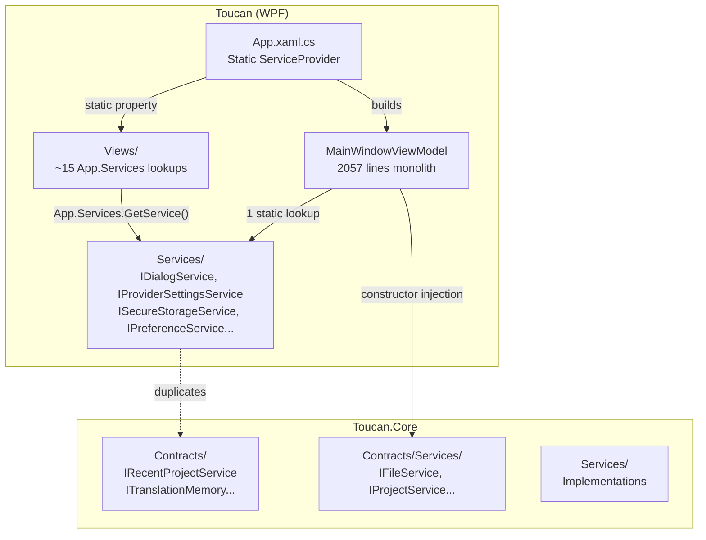
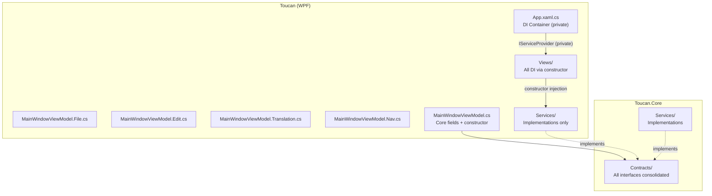
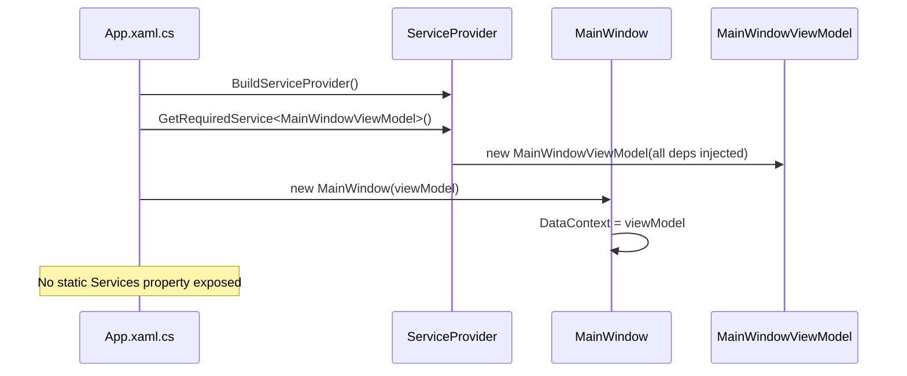
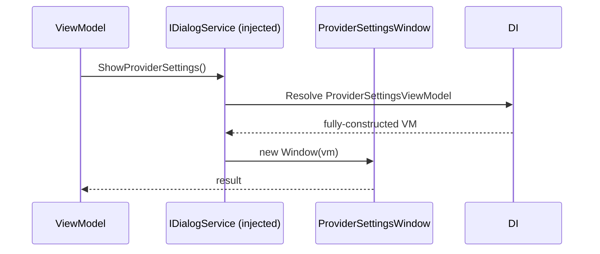

# Design Document: RC Phase 1 — Code Health

## Overview

This phase transforms the Toucan codebase from its current v0.7 state into release-candidate quality by eliminating all analyzer warnings, removing dead dependencies, decomposing the monolithic MainWindowViewModel, centralizing interface contracts in Core, and replacing static service locator patterns with proper constructor injection. The work targets three pillars: Static Analysis Cleanup (zero warnings, nullable annotations, Newtonsoft removal), Architecture Hygiene (ViewModel split, interface consolidation, DI migration), and Dependency Audit (pinned versions, vulnerability scan, .NET version documentation).

The guiding constraint is **no new features** — only restructuring, cleanup, and hardening of existing functionality. All changes must preserve current behavior while improving maintainability and correctness guarantees.

## Architecture

### Current State



### Target State



## Sequence Diagrams

### ViewModel Startup (After Refactoring)



### Dialog Opening (After Refactoring)



## Components and Interfaces

### Component 1: Interface Consolidation (Core Contracts)

**Purpose**: Eliminate duplicate interface definitions by moving all WPF-specific service interfaces into `Toucan.Core.Contracts` where they belong.

**Interfaces to Migrate**:

```csharp
// Move from Toucan.Services → Toucan.Core.Contracts
namespace Toucan.Core.Contracts;

public interface IDialogService
{
    string? ShowLanguagePrompt(string title, string message, IEnumerable<TranslationItem>? items);
    string? SelectFolder(string? initialPath);
    bool ShowNewProject(IProjectService projectService, out NewProjectResult? result);
    void ShowProviderSettings();
    bool ShowImportProject(out ImportProjectResult? result);
}

public interface IMessageService
{
    bool Confirm(string title, string message);
    void Info(string title, string message);
    void Error(string title, string message);
}

public interface IPreferenceService
{
    AppOptions Load();
    void Save(AppOptions options);
}

public interface IProviderSettingsService
{
    IEnumerable<ProviderSettings> LoadAppProviderSettings();
    void SaveAppProviderSettings(IEnumerable<ProviderSettings> settings);
    IEnumerable<ProviderSettings> LoadProjectProviderSettings(string projectPath);
    void SaveProjectProviderSettings(string projectPath, IEnumerable<ProviderSettings> settings);
}

public interface ISecureStorageService
{
    string Protect(string plain);
    string Unprotect(string protectedValue);
}
```

**Responsibilities**:
- Define platform-agnostic contracts for UI services
- Enable testability through mock implementations
- Single source of truth for all service interfaces

### Component 2: MainWindowViewModel Partial Class Split

**Purpose**: Decompose the 2057-line monolith into focused partial classes by concern.

**Interface (class structure)**:

```csharp
// MainWindowViewModel.cs — Core declaration, fields, constructor
namespace Toucan.ViewModels;

internal partial class MainWindowViewModel : ObservableObject
{
    // All fields and observable properties
    // Constructor with all injected dependencies
    // Shared helper methods (PagedUpdates, UpdatePageButtons)
}

// MainWindowViewModel.File.cs — File I/O operations
internal partial class MainWindowViewModel
{
    // LoadFolderAsync, OpenProject, SaveProject, SaveProjectAs
    // NewProject, CloseProject, ImportProject, ExportExcel
    // RecentProjects management
}

// MainWindowViewModel.Edit.cs — Edit operations  
internal partial class MainWindowViewModel
{
    // AddLanguage, RenameItem, DeleteItem, CreateNewItem
    // Undo/Redo, Copy/Paste, text transformations
    // ConvertLowercase, ConvertUppercase, TrimWhitespace, etc.
}

// MainWindowViewModel.Translation.cs — Translation operations
internal partial class MainWindowViewModel
{
    // PreTranslate, TranslationMemory suggestions
    // Provider settings lookup, BulkActions
    // Validation, Analysis
}

// MainWindowViewModel.Nav.cs — Navigation & filtering
internal partial class MainWindowViewModel
{
    // Search, ShowAll, FilterAndDisplay
    // Tree navigation, SelectedNode handling
    // Pagination, ViewMode toggle
    // Filter history
}
```

**Responsibilities**:
- Each partial class owns a single concern
- Shared state accessed through the common partial class definition
- No circular dependencies between concerns

### Component 3: DI Migration (Eliminate Static App.Services)

**Purpose**: Replace all 15+ `App.Services?.GetService()` lookups with constructor injection.

**Interface (revised App class)**:

```csharp
namespace Toucan;

public partial class App : Application
{
    // REMOVED: public static IServiceProvider Services { get; private set; }
    private IServiceProvider _services;

    private void Application_Startup(object sender, StartupEventArgs e)
    {
        var services = new ServiceCollection();
        ConfigureServices(services);
        _services = services.BuildServiceProvider();

        var mainWindow = _services.GetRequiredService<MainWindow>();
        mainWindow.Show();
    }

    private static void ConfigureServices(IServiceCollection services)
    {
        // All registrations here
        services.AddSingleton<MainWindow>();
        // ... 
    }
}
```

### Component 4: Newtonsoft.Json Removal

**Purpose**: Consolidate all JSON handling to `System.Text.Json`, removing the `Newtonsoft.Json` package dependency.

**Affected Files**:
- `Services/RecentProjectServices.cs` — serialization of recent project list
- `Services/ProviderSettingsService.cs` — provider settings persistence
- `ViewModels/OptionsViewModel.cs` — project manifest reading/writing
- `ViewModels/MainWindowViewModel.cs` — project manifest parsing (line 1191)

## Data Models

### Partial Class File Mapping

```csharp
// Decision model: which methods go where
public record PartialClassMapping
{
    public string FileName { get; init; }
    public string Concern { get; init; }
    public string[] MethodPatterns { get; init; }
}

// The mapping:
static readonly PartialClassMapping[] Mappings = 
[
    new() { 
        FileName = "MainWindowViewModel.File.cs",
        Concern = "File Operations",
        MethodPatterns = ["*Project*", "Load*", "Save*", "*Recent*", "*Import*", "*Export*", "*Excel*", "*Folder*"]
    },
    new() { 
        FileName = "MainWindowViewModel.Edit.cs",
        Concern = "Edit Operations",
        MethodPatterns = ["*Language*", "*Rename*", "*Delete*", "*Create*", "*Undo*", "*Redo*",
                          "Convert*", "Trim*", "Simplify*", "Apply*"]
    },
    new() { 
        FileName = "MainWindowViewModel.Translation.cs",
        Concern = "Translation Operations",
        MethodPatterns = ["*Translate*", "*Provider*", "*Bulk*", "*Validat*", "*Analyz*", "*Suggest*"]
    },
    new() { 
        FileName = "MainWindowViewModel.Nav.cs",
        Concern = "Navigation & Filtering",
        MethodPatterns = ["Search*", "*Filter*", "*Page*", "*Tree*", "*Node*", "Show*",
                          "*ViewMode*", "*History*", "RefreshTree"]
    }
];
```

### NuGet Dependency Target

```csharp
// Current WPF dependencies (12 packages):
// 1. Avalonia 12.0.5                    ← REMOVE (WPF project shouldn't ref Avalonia)
// 2. Avalonia.Desktop 12.0.5            ← REMOVE
// 3. CommunityToolkit.Mvvm 8.4.2        ← KEEP
// 4. Newtonsoft.Json 13.0.4             ← REMOVE (replace with System.Text.Json)
// 5. Ookii.Dialogs.Wpf 5.0.1           ← KEEP
// 6. System.Data.DataSetExtensions      ← REMOVE (preview, likely unused)
// 7. UpgradeAssistant.Analyzers         ← REMOVE (one-time migration tool)
// 8. WPF-UI 4.3.0                       ← KEEP
// 9. Microsoft.Extensions.DI 10.0.9     ← KEEP
// 10. Microsoft.Extensions.Logging       ← KEEP
// 11. Microsoft.Extensions.Logging.Console ← KEEP (or merge with above)
// 12. xunit.v3 3.2.2                    ← REMOVE (test dep in wrong project)

// Target (≤ 8 packages):
// 1. CommunityToolkit.Mvvm 8.4.2
// 2. Ookii.Dialogs.Wpf 5.0.1
// 3. WPF-UI 4.3.0
// 4. Microsoft.Extensions.DependencyInjection 10.0.9
// 5. Microsoft.Extensions.Logging 10.0.9
// 6. Microsoft.Extensions.Logging.Console 10.0.9
// → 6 packages total (well under target of 8)
```

## Algorithmic Pseudocode

### Algorithm 1: Static Service Locator Migration

```csharp
// ALGORITHM: MigrateStaticLookups
// INPUT: Set of files containing App.Services?.GetService() calls
// OUTPUT: Files refactored to use constructor injection
//
// PRECONDITIONS:
//   - All target types are registered in DI container
//   - No circular dependencies exist between view models
//
// POSTCONDITIONS:
//   - Zero references to App.Services remain (except App.xaml.cs private field)
//   - All resolved services come through constructor parameters
//   - Behavior is identical to pre-refactoring

// Step 1: For each View code-behind with App.Services usage:
//   1a. Add constructor parameter for the required service
//   1b. Store in readonly field
//   1c. Replace App.Services.GetService(typeof(T)) with _field
//   1d. Register the View in DI so constructor injection works

// Step 2: For ViewModels with App.Services usage (1 occurrence in MainWindowViewModel):
//   2a. Add IProviderSettingsService to constructor params (already partially done)
//   2b. Replace the static lookup with the injected field

// Step 3: Remove public static Services property from App class
// Step 4: Make IServiceProvider a private field in App
```

### Algorithm 2: Nullable Annotation Migration

```csharp
// ALGORITHM: EnableNullableAnnotations
// INPUT: Toucan.csproj with <Nullable>warnings</Nullable>
// OUTPUT: Toucan.csproj with <Nullable>enable</Nullable>, zero new warnings
//
// PRECONDITIONS:
//   - Project compiles cleanly with <Nullable>warnings</Nullable>
//   - All Core contracts already use nullable annotations
//
// POSTCONDITIONS:
//   - <Nullable>enable</Nullable> in csproj
//   - Zero CS8600-CS8605 nullable warnings
//   - All public APIs have correct nullable annotations
//   - No suppression operators (!) except where explicitly justified

// Phase A: Enable and collect warnings
//   1. Change csproj: <Nullable>enable</Nullable>
//   2. Build → collect all CS86xx warnings
//   3. Categorize: {field-init, parameter, return-type, dereference}

// Phase B: Fix by category (safest first)
//   1. Fields that can be null → add '?' annotation
//   2. Parameters that accept null → add '?' annotation  
//   3. Return types that may be null → add '?', update callers
//   4. Dereferences of nullable → add null checks or '!' with comment

// Phase C: Verify
//   1. Build with zero warnings
//   2. Run existing test suite — no regressions
```

### Algorithm 3: Newtonsoft.Json Replacement

```csharp
// ALGORITHM: ReplaceNewtonsoftWithSystemTextJson
// INPUT: 4 files using Newtonsoft.Json (JObject, JArray, JsonConvert)
// OUTPUT: Same files using System.Text.Json (JsonDocument, JsonNode, JsonSerializer)
//
// PRECONDITIONS:
//   - All JSON files follow standard format (no comments, no trailing commas)
//   - System.Text.Json is already available via framework reference
//
// POSTCONDITIONS:
//   - Newtonsoft.Json PackageReference removed from csproj
//   - All JSON read/write operations produce identical output
//   - Round-trip: serialize → deserialize → serialize yields same result
//
// MIGRATION MAP:
//   Newtonsoft                    → System.Text.Json
//   ─────────────────────────────────────────────────
//   JObject.Parse(text)          → JsonNode.Parse(text)?.AsObject()
//   root["key"]?.ToString()      → root["key"]?.GetValue<string>()
//   root["key"] as JObject       → root["key"]?.AsObject()
//   root["key"] as JArray        → root["key"]?.AsArray()
//   new JObject()                → new JsonObject()
//   new JArray(items)            → new JsonArray(items)
//   JsonConvert.SerializeObject  → JsonSerializer.Serialize
//   JsonConvert.DeserializeObject→ JsonSerializer.Deserialize<T>

// Step 1: Migrate RecentProjectServices.cs
//   - Replace JsonConvert.SerializeObject/DeserializeObject
//   - Use JsonSerializerOptions { WriteIndented = true }

// Step 2: Migrate ProviderSettingsService.cs  
//   - Same pattern as Step 1

// Step 3: Migrate OptionsViewModel.cs (JObject/JArray manipulation)
//   - Use JsonNode API for dynamic JSON access
//   - Preserve exact same manifest structure on write

// Step 4: Migrate MainWindowViewModel.cs line 1191
//   - Replace JObject.Parse with JsonNode.Parse

// Step 5: Remove <PackageReference Include="Newtonsoft.Json" /> from csproj
// Step 6: Run tests + manual verify of project manifest round-trip
```

### Algorithm 4: MainWindowViewModel Decomposition

```csharp
// ALGORITHM: DecomposeViewModel
// INPUT: MainWindowViewModel.cs (2057 lines, single file)
// OUTPUT: 5 partial class files, same total behavior
//
// PRECONDITIONS:
//   - All methods are instance methods on MainWindowViewModel
//   - No method name collisions between concerns
//   - CommunityToolkit.Mvvm source generators work with partial classes
//
// POSTCONDITIONS:
//   - Sum of lines across all files ≈ original line count
//   - All [RelayCommand] attributes still generate commands
//   - All [ObservableProperty] attributes still generate properties
//   - No behavioral change — purely structural refactor
//
// LOOP INVARIANT: 
//   After moving each method group, the project still compiles
//   and all existing tests pass

// Step 1: Create MainWindowViewModel.File.cs
//   - Move: OpenProject, LoadFolderAsync, SaveProject, SaveProjectAs,
//           CloseProject, NewProject, ImportProject, ExportExcel,
//           RefreshRecentProjects, all recent-project related commands
//   - Keep file I/O related private helpers

// Step 2: Create MainWindowViewModel.Edit.cs
//   - Move: AddLanguage, RenameItem, DeleteItem, CreateNewItem,
//           Undo, Redo, ApplyUndoRedo, text transforms (Convert*, Trim*, Simplify*),
//           clipboard operations, ApplyToAllValues helper
//   - Move edit-related CanExecute methods

// Step 3: Create MainWindowViewModel.Translation.cs
//   - Move: PreTranslate flow, provider options building,
//           validation commands, analysis commands,
//           translation memory / suggestions, bulk actions

// Step 4: Create MainWindowViewModel.Nav.cs
//   - Move: Search, ShowAll, FilterAndDisplay, pagination,
//           OnSearchTextChanged, OnSelectedNodeChanged,
//           ViewMode toggling, filter history, RefreshTree

// Step 5: Retain in MainWindowViewModel.cs (core file)
//   - All field declarations and [ObservableProperty] members
//   - Constructor
//   - PagedUpdates, UpdatePageButtons (shared infrastructure)
//   - OpenUrl (utility)

// Step 6: Verify
//   - dotnet build → 0 errors
//   - dotnet test → all pass
//   - Manual smoke test of each operation category
```

## Key Functions with Formal Specifications

### Function: ConfigureServices

```csharp
private static void ConfigureServices(IServiceCollection services)
```

**Preconditions:**
- `services` is a valid, empty `IServiceCollection`

**Postconditions:**
- All service interfaces have exactly one implementation registered
- All ViewModels are registered as Transient (except StatusBarViewModel: Singleton)
- All Core services are registered as Singleton
- No service has a dependency on `App` static members
- `IServiceProvider` is not directly registered (avoids service locator pattern)

**Loop Invariants:** N/A

### Function: MigrateJsonUsage (per file)

```csharp
// Conceptual — applied manually per file
void MigrateJsonUsage(string filePath)
```

**Preconditions:**
- File compiles with Newtonsoft.Json references
- All JSON data handled is valid JSON (no JSONC, no trailing commas)

**Postconditions:**
- File compiles without Newtonsoft.Json references
- Serialized output is byte-for-byte identical for same input data
- Deserialization handles all edge cases (null, empty, missing keys) identically

### Function: SplitPartialClass

```csharp
void SplitPartialClass(string sourceFile, PartialClassMapping[] mappings)
```

**Preconditions:**
- `sourceFile` compiles without errors
- All methods in source are instance methods of the partial class
- `mappings` covers all methods (no orphans)
- No two mappings claim the same method

**Postconditions:**
- For each mapping: a new `.cs` file exists containing only the mapped methods
- Original file retains only field declarations, constructor, and unmapped infrastructure
- `dotnet build` succeeds with zero errors
- All `[RelayCommand]` source generation still works
- All `[ObservableProperty]` source generation still works

**Loop Invariants:**
- After each method group is moved, the build remains green

## Example Usage

### Before: Static Service Locator

```csharp
// Current anti-pattern in OptionsDialog.xaml.cs
public OptionsDialog(string projectPath)
{
    InitializeComponent();
    IPreferenceService pref = App.Services?.GetService(typeof(IPreferenceService)) 
        as IPreferenceService ?? new PreferenceService();
    vm = App.Services?.GetService(typeof(OptionsViewModel)) as OptionsViewModel 
        ?? new OptionsViewModel(pref);
}
```

### After: Constructor Injection

```csharp
// Refactored — all dependencies injected
public OptionsDialog(OptionsViewModel viewModel)
{
    InitializeComponent();
    DataContext = viewModel;
}

// DI registration handles the wiring:
services.AddTransient<OptionsDialog>();
services.AddTransient<OptionsViewModel>();
```

### Before: Newtonsoft.Json

```csharp
// Current code in OptionsViewModel.cs
var root = Newtonsoft.Json.Linq.JObject.Parse(text);
var editorCfg = root["editorConfiguration"] as Newtonsoft.Json.Linq.JObject 
    ?? new Newtonsoft.Json.Linq.JObject();
editorCfg["save_empty_translations"] = value.ToString().ToLowerInvariant();
editorCfg["copy_templates"] = new Newtonsoft.Json.Linq.JArray(t1, t2, t3);
```

### After: System.Text.Json

```csharp
// Migrated to System.Text.Json.Nodes
using System.Text.Json.Nodes;

var root = JsonNode.Parse(text)?.AsObject() 
    ?? throw new InvalidOperationException("Invalid project manifest");
var editorCfg = root["editorConfiguration"]?.AsObject() ?? new JsonObject();
editorCfg["save_empty_translations"] = value.ToString().ToLowerInvariant();
editorCfg["copy_templates"] = new JsonArray(t1, t2, t3);

// Write back with indentation
var options = new JsonSerializerOptions { WriteIndented = true };
File.WriteAllText(manifestPath, root.ToJsonString(options));
```

## Correctness Properties

*A property is a characteristic or behavior that should hold true across all valid executions of a system — essentially, a formal statement about what the system should do. Properties serve as the bridge between human-readable specifications and machine-verifiable correctness guarantees.*

### Property 1: JSON serialization round-trip

*For any* valid Toucan data object (project manifest, provider settings, or recent project entry), serializing with System.Text.Json and then deserializing SHALL produce an object equal to the original.

**Validates: Requirements 3.4, 3.5, 3.6**

### Property 2: Backward-compatible JSON deserialization

*For any* valid JSON string that could have been produced by Newtonsoft.Json (varying in property casing, indentation, and formatting), deserializing with System.Text.Json SHALL produce a correctly populated object with no data loss.

**Validates: Requirements 3.7, 10.4**

### Property 3: Project manifest read-write round-trip

*For any* valid project manifest file, reading the manifest and writing it back without modification SHALL produce output equivalent to the original input (preserving structure and values).

**Validates: Requirements 3.4, 10.3**

## Error Handling

### Error Scenario 1: Nullable Migration Breaks at Runtime

**Condition**: Enabling `<Nullable>enable</Nullable>` reveals a code path where a null value is passed to a non-nullable parameter at runtime (not caught at compile time due to external data).
**Response**: Add explicit null checks with informative `ArgumentNullException` or graceful fallback matching current behavior.
**Recovery**: Existing exception handlers in `ReportUnhandledException` will catch. Unit tests should cover null input paths.

### Error Scenario 2: System.Text.Json Behavioral Differences

**Condition**: `System.Text.Json` handles edge cases differently than Newtonsoft (e.g., comment handling, trailing commas, property name casing).
**Response**: Configure `JsonSerializerOptions` to match Newtonsoft behavior: `PropertyNameCaseInsensitive = true`, `ReadCommentHandling = JsonCommentHandling.Skip`.
**Recovery**: Round-trip tests for all affected JSON files verify equivalence before and after migration.

### Error Scenario 3: Partial Class Source Generator Issues

**Condition**: CommunityToolkit.Mvvm source generators may not find `[RelayCommand]` attributes across partial class files.
**Response**: Ensure all partial files share the same namespace, class declaration (including `partial` keyword), and that `[ObservableProperty]` fields remain in a single file (the core file).
**Recovery**: Build immediately after each file move; revert if source gen breaks.

### Error Scenario 4: Captive Dependency (Singleton → Transient)

**Condition**: A Singleton service captures a Transient dependency, causing the Transient to live forever.
**Response**: Audit all DI registrations using `IServiceCollection` inspection. Move any violated services to the correct lifetime or use factory pattern.
**Recovery**: Add `ValidateOnBuild = true` to `BuildServiceProvider()` to catch at startup.

## Testing Strategy

### Unit Testing Approach

- **JSON round-trip tests**: For each migrated file, verify serialize/deserialize produces identical results with both old (Newtonsoft snapshot) and new (System.Text.Json) code
- **DI validation tests**: Verify all services resolve correctly, no missing registrations, no captive dependencies
- **ViewModel command tests**: Verify all `[RelayCommand]` methods still generate properly across partial class files

### Property-Based Testing Approach

**Property Test Library**: FsCheck (C# / .NET compatible)

- **P1**: For any valid JSON string, `JsonNode.Parse(s).ToJsonString()` round-trips correctly
- **P2**: For any `ProviderSettings` object, serialization with `System.Text.Json` produces valid JSON that deserializes back to an equal object
- **P3**: For any sequence of DI registrations, `ValidateOnBuild` catches all lifetime violations

### Integration Testing Approach

- Full build verification after each refactoring step
- Smoke test: Open project → edit → save → reload → verify no data loss
- Verify all 15 static `App.Services` call sites work correctly through DI

## Performance Considerations

- **Build time**: Partial class split should not significantly affect build time (source generators run per-project, not per-file)
- **Startup time**: Removing static property access and using direct DI resolution may marginally improve startup (no double-resolution)
- **Runtime**: `System.Text.Json` is generally faster than Newtonsoft.Json for serialization/deserialization, so JSON operations should improve
- **Package restore**: Fewer packages (12 → 6) reduces restore time in CI

## Security Considerations

- **Secure storage**: `ISecureStorageService` using DPAPI remains unchanged in implementation; only the interface location moves
- **No secrets in source**: Ensure migration doesn't accidentally serialize API keys in plain text during JSON migration
- **Dependency vulnerabilities**: `dotnet list package --vulnerable` must return zero known vulnerabilities after pinning versions
- **No preview packages**: Remove `System.Data.DataSetExtensions 4.6.0-preview3` which may have unpatched issues

## Dependencies

### Packages to Remove

| Package | Reason |
|---------|--------|
| `Newtonsoft.Json 13.0.4` | Replaced by `System.Text.Json` (in-box) |
| `Avalonia 12.0.5` | Wrong project (WPF doesn't need Avalonia) |
| `Avalonia.Desktop 12.0.5` | Wrong project |
| `System.Data.DataSetExtensions 4.6.0-preview3` | Unused preview package |
| `Microsoft.DotNet.UpgradeAssistant.Extensions.Default.Analyzers 0.4.421302` | One-time migration tool, no longer needed |
| `xunit.v3 3.2.2` | Test framework in non-test project — move to test projects only |

### Packages to Keep (Pinned)

| Package | Version | Purpose |
|---------|---------|---------|
| `CommunityToolkit.Mvvm` | `8.4.2` | MVVM source generators |
| `Ookii.Dialogs.Wpf` | `5.0.1` | Native file/folder dialogs |
| `WPF-UI` | `4.3.0` | Modern WPF controls (Fluent) |
| `Microsoft.Extensions.DependencyInjection` | `10.0.9` | DI container |
| `Microsoft.Extensions.Logging` | `10.0.9` | Logging abstractions |
| `Microsoft.Extensions.Logging.Console` | `10.0.9` | Console log sink |

### Tools Required

- `dotnet list package --vulnerable` — vulnerability scanning
- `dotnet build /warnaserror` — verify zero warnings
- .NET 10 SDK (current target framework: `net10.0-windows7.0`)
