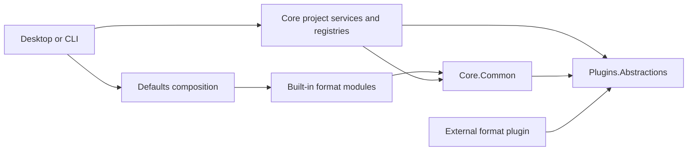
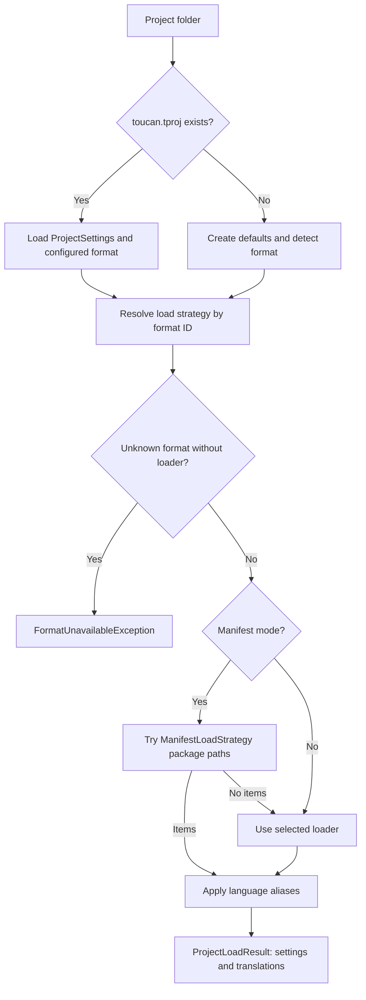

# Toucan.Core interop architecture

Toucan normalizes translation resources into a shared model and resolves format implementations through DI. Core coordinates project IO and shared services; concrete parsers and writers live in built-in modules or external plugins. See the [application architecture](../docs/ARCHITECTURE.md) for host composition, desktop state, lifecycle, AI, and trust integration.

## Model and boundaries

[TranslationItem](../Toucan.Plugins.Abstractions/Models/TranslationItem.cs) represents a language, namespace/key, value, and translation metadata. The editor store identifies records by `(Language, Namespace)`. Hierarchical resources flatten into namespace paths; settings and individual format implementations govern escaping, structure, plural representation, and round-trip behavior. Normalization does not guarantee lossless conversion between every pair of formats.

Public plugin contracts and DTOs reside in `Toucan.Plugins.Abstractions`, even when their namespaces begin with `Toucan.Core`. Shared parsing/file helpers and the built-in module registration seam reside in `Toucan.Core.Common`. Core references these projects but no built-in module. Modules reference Common and Abstractions without referencing Core or sibling modules. [ArchitectureTests](../tests/Toucan.Core.Tests/Modules/ArchitectureTests.cs) enforces these rules.

## Format contract

[ILoadStrategy](../Toucan.Plugins.Abstractions/Contracts/ILoadStrategy.cs) exposes `FormatId` and `Load(folder)`. [ISaveStrategy](../Toucan.Plugins.Abstractions/Contracts/ISaveStrategy.cs) writes a `SaveContext` and owns file-layout metadata: `DefaultFilePath`, `LanguageFiles`, `FileExtensions`, `CommentSidecarBase`, `StoresCommentsInline`, and optional `Detection`.

`TranslationStrategyFactory` resolves these registrations by string ID. `FormatDetector` evaluates save-strategy detection rules. A plugin format participates through the same contracts; the orchestration layer does not need a new format-specific branch for ordinary loading and serialization.

| Family module | Registered resource formats |
|---|---|
| `Toucan.Modules.Formats.Json` | JSON, namespaced JSON, ARB; also the manifest loader |
| `Toucan.Modules.Formats.Xml` | Android XML, XLIFF, RESX |
| `Toucan.Modules.Formats.Text` | PO, INI, Java properties, iOS strings, Laravel PHP, CSV |
| `Toucan.Modules.Formats.Data` | YAML, TOML |

INI is save-only. Format availability, layout conventions, and fidelity must be checked against its registered strategies rather than inferred from a general supported-formats list.

## Project loading

The persisted manifest is **`toucan.tproj`**, loaded by [ProjectSettings](Models/ProjectSettings.cs). It stores a string `saveFormat`, languages, package URLs, and project preferences. Legacy `saveStyle` values migrate on load.

[ProjectService](Services/ProjectService.cs) performs this integration. [ProjectModeResolver](Services/ProjectModeResolver.cs) checks for the manifest; framework detection is a separate registered capability, not a call made by this resolver. Built-in formats without a loader retain the legacy JSON fallback. Unknown external format IDs fail explicitly to prevent misreading and subsequent overwriting.

The desktop lifecycle wraps loading with cancellation/progress, unsaved-change handling, baseline initialization, file watching, metadata/comments, and auto-save. Direct `ProjectService` callers do not automatically receive those steps.

## Save and metadata integration

`ProjectService.Save` builds a `SaveContext` containing language groups, language IDs, and namespace tree items, then calls the selected writer. Language aliases are reversed for output and restored for in-memory display. The project-aware overload updates manifest languages and applies configured encoding/line endings to known built-in language files; Java properties keeps Latin-1 encoding.

The desktop [ProjectLifecycleService](Services/ProjectLifecycleService.cs) validates before saving. Error-severity results block writes. It then persists resources, comments, audit metadata, and package settings before marking baselines saved and updating watcher/merge snapshots. This is a multi-file sequence, not an atomic project transaction.

[CommentPersistenceService](Services/CommentPersistenceService.cs) delegates inline-comment support and sidecar placement to strategy metadata. [AuditService](Services/AuditService.cs) persists `.toucan-metadata.json`. Neither arbitrary format conversion nor a direct writer call guarantees preservation of every source format's metadata.

## Adding a format

1. Implement the load and/or save contracts in the appropriate family module. Use a stable format ID; a read/write pair shares it.
2. Declare file layout, extensions, detection, and comment capabilities on the writer. Check multiple-language and nested-path behavior.
3. Register using `AddFormatStrategy` in that module. Keep Core independent of concrete implementations.
4. Update module snapshots and add meaningful load/save round-trip tests, including escaping, plural data, metadata, and encoding where relevant.
5. For external distribution, use the [plugin guide](../docs/plugins.md) and [sample plugin](../samples/Toucan.Sample.Plugin). Do not add a module reference to Core.

Cross-tool manifest import, including new ecosystems, requires an explicit implementation and tests; similar resource syntax alone is not evidence of complete interoperability. Future editor syntax coloring is separate from format parsing and remains in the [highlighting plan](../docs/specs/design/editor-syntax-highlighting.md).
