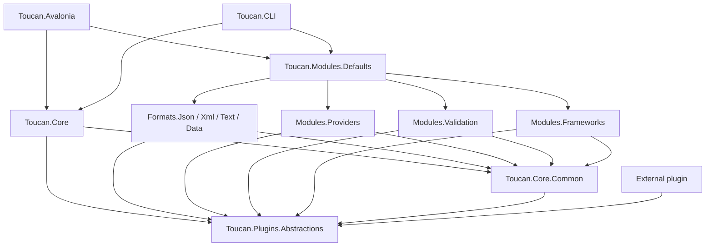
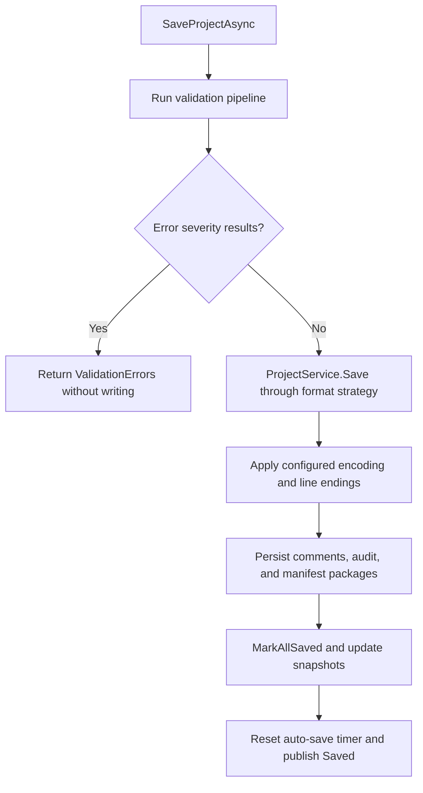
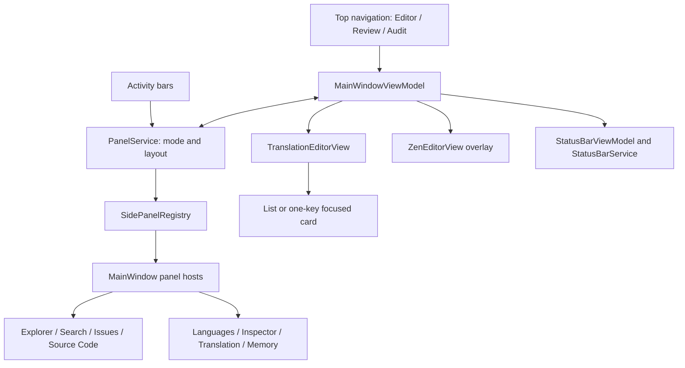
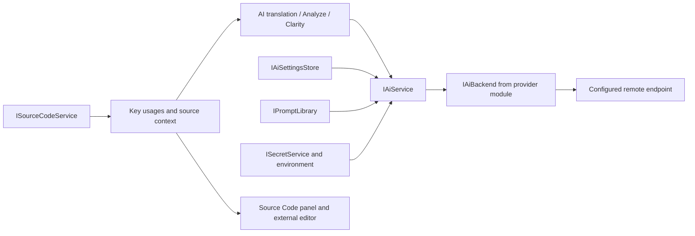

# Toucan architecture

Toucan is a .NET 10 translation resource editor with an Avalonia desktop host and a console host. Both compose the same format engine, provider registry, validation pipeline, and plugin system. The desktop adds project lifecycle orchestration, editor state, platform dialogs, and visual composition.

This document describes the checked-in implementation. Future editor highlighting is tracked separately in the [syntax highlighting plan](specs/design/editor-syntax-highlighting.md). The [Core interop architecture](../Toucan.Core/ARCHITECTURE.md) covers translation normalization and format integration; [plugin authoring](plugins.md) and [AI integration](ai-integration.md) cover their respective contracts and configuration.

## Project boundaries

Arrows below mean project references. Runtime registration does not create a Core-to-module dependency.



| Project | Responsibility | Boundary |
|---|---|---|
| `Toucan.Plugins.Abstractions` | Plugin entry point, format/provider/rule/profile contracts, shared DTOs | No Core or UI dependency. Some public types retain `Toucan.Core.*` namespaces for compatibility. |
| `Toucan.Core.Common` | Shared file/helpers code and built-in module registration support | References Abstractions; never Core or a module. |
| `Toucan.Core` | Project IO and lifecycle implementations, registries, validation pipeline, AI policy, plugin host, editing services | No Avalonia dependency and no reference to built-in modules. |
| `Toucan.Modules.*` | Concrete formats, providers, validation rules, framework profiles | Leaf modules reference Common and Abstractions, not Core or sibling modules. |
| `Toucan.Modules.Defaults` | Registers the seven built-in modules | The aggregation point that references every module. |
| `Toucan.Avalonia` | Desktop startup, views, view models, platform services, application state | Composes Core and Defaults; uses Avalonia and FluentAvalonia. |
| `Toucan.CLI` | Console commands for checking, translation, export, key access, and plugin policy | Composes Core and Defaults without constructing the desktop lifecycle. |

These boundaries are executable rules in [ArchitectureTests](../tests/Toucan.Core.Tests/Modules/ArchitectureTests.cs). Assembly placement matters more than namespaces: built-in strategies still use `Toucan.Core.Services.*` namespaces while their code lives in module projects.

## Composition and startup

The composition sequence is shared, but the desktop and CLI do not register identical service sets. [AddToucanCore](../Toucan.Core/ToucanCoreServiceCollectionExtensions.cs) installs shared registries, factories, IO, validation, AI services, project services, and comments. It does **not** register the complete desktop editor or lifecycle graph.


[AddToucanDefaults](../Toucan.Modules.Defaults/ToucanDefaults.cs) registers formats, frameworks, providers, and validation rules, recording their built-in identities before external plugins load. Plugins contribute to the same service collection before it is built. Their IDs cannot replace reserved built-in registrations.

The desktop composition root is [App.ConfigureServices](../Toucan.Avalonia/App.axaml.cs). Most project/editor services and the main/status view models are singletons; dialogs such as Options and AI settings use transient view models. Host adapters supply dialogs, messages, preferences, recent projects, and provider settings. The lifecycle receives a lazy reference through auto-save to avoid constructing a circular dependency.

After framework initialization, the desktop applies theme/color/font preferences, registers eight side panels, creates the window, and attaches unsaved-change and external-change handlers. A dispatcher callback marshals reload/merge work to the UI thread and refreshes the editor from the store. Startup onboarding precedes opening the selected or last project; pending-plugin prompts follow opening. File activation on macOS also routes to the project-open command.

[CLI Program](../Toucan.CLI/Program.cs) builds the shared container for its commands. It applies plugin policy without desktop prompts, and supports a per-run plugin allowance. Changes to shared composition should be checked against [CompositionRootTests](../tests/Toucan.Core.Tests/CompositionRootTests.cs), not only desktop startup.

## Dialog and message integration

[IDialogService](../Toucan.Avalonia/Services/IDialogService.cs) is a **desktop-layer contract**, not a Core or plugin contract. It returns desktop view models and exposes file/folder pickers, prompts, and feature dialogs. [DialogService](../Toucan.Avalonia/Services/DialogService.cs) implements it using Avalonia `StorageProvider` pickers and owned modal windows. View models receive the interface through DI, including `MainWindowServices.Dialogs`, so commands can await a user result without constructing windows themselves.

```mermaid
sequenceDiagram
    actor User
    participant VM as Desktop view model
    participant Dialog as IDialogService / DialogService
    participant Owners as AppWindows
    participant UI as StorageProvider or modal window
    User->>VM: Run command
    VM->>Dialog: Await picker or feature dialog
    Dialog->>Owners: Resolve active owner
    Owners-->>Dialog: Active or visible window; main window fallback
    Dialog->>UI: Open picker or ShowDialog(owner)
    UI-->>Dialog: Accepted result or cancellation
    Dialog-->>VM: Path, view model, options, boolean, or null
    VM->>VM: Apply accepted result or stop on cancellation
```

`App.ConfigureServices` registers `IDialogService` as a singleton. The implementation resolves transient view models from DI for New Project, Options, Provider Settings, and Onboarding; it directly constructs others with request-specific state, or accepts an already-prepared view model such as Pre-Translate. Dialog lifetime and view-model lifetime are therefore separate from the singleton service lifetime.

[AppWindows.Active](../Toucan.Avalonia/Services/AppWindows.cs) chooses the active window, then a visible window, then the main window. Nested dialogs and pickers consequently use the current dialog as their owner. `DialogService` requires an available owner and throws if no window exists. New callers should run on the UI thread; unlike the message service, this implementation does not add dispatcher marshaling around its methods. Pickers return local paths when available, and result-bearing dialogs use null or false for cancellation. `Shutdown` closes the main window so its unsaved-change guard still runs.

Messages use a separate boundary: [IAsyncMessageService and MessageService](../Toucan.Avalonia/Services/MessageService.cs). They provide information, confirmation, and three-way choices using FluentAvalonia `FAContentDialog` overlays. DI exposes the same `MessageService` instance through both `IAsyncMessageService` and the Core `IMessageService` contract. The implementation marshals display to the UI thread. Its synchronous confirmation adapter runs a nested dispatcher frame; async desktop commands should prefer `ConfirmAsync` or `ChooseAsync`.

The lifecycle's unsaved-change and external-change handlers use these message interactions rather than depending on desktop `IDialogService`. `App.Dialogs` is a static bridge for view/menu code that is not created through DI; it is not the preferred dependency path for view models. [TestHost](../tests/Toucan.Avalonia.Tests/TestHost.cs) substitutes fake dialog/message implementations so command behavior can be checked without opening native pickers or blocking on modal windows.

## Translation model and format integration

The canonical record is `TranslationItem`, identified in the editing store by `(Language, Namespace)`. It includes the value and translation metadata; format loaders flatten resources into these records. `LanguageGroupViewModel` groups them into editor cards, including plural variants. The UI tree and paged cards are projections of the store, not separate persistence formats.

| Component | Integration point |
|---|---|
| `ILoadStrategy` | Enumerates translations from a folder. |
| `ISaveStrategy` | Writes a `SaveContext`; declares display name, extensions, default paths, language files, comment handling, and detection rules. |
| `TranslationStrategyFactory` | Resolves registered strategies by string format ID. |
| `FormatDetector` | Evaluates save strategies' detection rules for folders without settings. |
| `ProjectModeResolver` | Distinguishes a folder containing `toucan.tproj` from a folder scan. |
| `ManifestLoadStrategy` | Loads configured translation package paths when manifest mode is selected. |
| `ProjectService` | Coordinates settings, format selection, language aliases, load/save, and output text settings. |

See [ProjectService](../Toucan.Core/Services/ProjectService.cs) and the [Core format guide](../Toucan.Core/ARCHITECTURE.md). An unavailable external format raises `FormatUnavailableException`; it is not silently interpreted as JSON. Built-in formats without loaders retain a legacy JSON fallback, so a listed save format does not imply equivalent loading support.

## Project lifecycle and persistence

The desktop delegates guarded project operations to [ProjectLifecycleService](../Toucan.Core/Services/ProjectLifecycleService.cs). Lower-level callers such as the CLI can use `ProjectService` directly and therefore do not automatically receive lifecycle validation, sidecar orchestration, auto-save, or UI prompts.

```mermaid
sequenceDiagram
    actor User
    participant VM as MainWindowViewModel
    participant Life as ProjectLifecycleService
    participant IO as ProjectService
    participant Store as TranslationManagementService
    participant Support as Watcher / audit / comments
    User->>VM: Open project
    VM->>Life: OpenProjectAsync(folder)
    opt Current project is dirty
        Life->>Life: CloseProjectAsync with unsaved-change handler
    end
    Life->>IO: LoadProject on background task
    IO->>IO: Load settings or detect format; select loader
    IO-->>Life: Settings and translations
    Life->>Store: Initialize items and baselines
    Life->>Support: Watch folder; load audit and comments
    Life->>Life: Set project; snapshot; start configured auto-save
    Life-->>VM: ProjectChanged(Opened)
    VM->>VM: Rebuild editor projections
```

Open handles cancellation, invalid manifests, missing folders, and unavailable formats as explicit outcomes. Format scanning receives cancellation/progress through `ScanContext`.

Editing flows through [TranslationItemViewModel](../Toucan.Avalonia/ViewModels/TranslationItemViewModel.cs): its commit records undo information, updates direct-edit metadata, and calls `NotifyValueChanged`. [TranslationManagementService](../Toucan.Core/Services/TranslationManagementService.cs) compares values/comments against baselines and debounces dirty-state notifications. UI actions that modify data must use the store and refresh projections consistently; writing a view model field alone is insufficient.



The save strategy owns translation serialization. Project text settings are applied afterward to language files reported by built-in strategies; Java properties retains Latin-1 encoding. The post-processing does not apply arbitrary encoding changes to plugin formats. Comment sidecars are used when `StoresCommentsInline` is false. Audit uses `.toucan-metadata.json`.

Save spans multiple files and sidecars; it is not a transaction across the project. Do not describe successful individual file writes as an atomic project commit. The lifecycle marks baselines saved only after its persistence steps complete.

External changes are coordinated by [ProjectLifecycleService.ExternalChanges](../Toucan.Core/Services/ProjectLifecycleService.ExternalChanges.cs). A clean project reloads automatically. A dirty project offers Reload, Merge, or Ignore through the host handler. Merge uses the saved snapshot, in-memory records, and disk records; it applies non-conflicting entries before asking for conflict resolution. Cancelling that dialog therefore does not undo already-applied entries.

## Desktop shell and editor state

[MainWindow](../Toucan.Avalonia/Views/MainWindow.axaml) owns the title/navigation bar, two activity rails, a shared rounded workspace, and the status bar. Its [code-behind](../Toucan.Avalonia/Views/MainWindow.axaml.cs) handles platform chrome, panel view creation/cache, splitter widths, adaptive panel fitting, and rounded content clipping. Business operations remain in the view models and Core services.



The eight panels are registered in `App.RegisterSidePanels`. `SidePanelRegistry` tracks active panels and slot visibility; [PanelService](../Toucan.Avalonia/Services/PanelService.cs) provides commands and persists layout. These are process-wide singleton bridges rather than dynamically injected plugin views. Adding an ordinary panel requires both registry registration and a corresponding view mapping in `MainWindow.GetPanel`.

Editor/Review/Audit are application modes selected in the top navigation. Audit disables editing; Review changes the working set and review actions. One-key focused editing is a separate presentation of the current filtered data: navigation clamps to the data bounds, synchronizes selection, and returns to the page containing the current card. Zen uses its own overlay and hides surrounding layout. These states are not interchangeable.

The status bar combines registered panels with desktop behavior. Encoding and LF/CRLF menus modify project settings used on save; the notification menu combines untranslated entries with validation results. Settings use reusable `SettingsGroup`, `SettingsRow`, and `SettingsList` controls, with shared styles in [AppStyles](../Toucan.Avalonia/Styles/AppStyles.axaml). UI labels use the [locale resources](../Toucan.Avalonia/Locales), while translation values belong to the project data.

## Providers, AI, and source integration

[PretranslationService](../Toucan.Core/Services/PretranslationService.cs) builds translation jobs, resolves a provider from `TranslationProviderRegistry`, protects placeholders, calls the provider, and restores placeholders/capitalization. With `PreviewOnly`, it returns results without applying values; otherwise it can update supplied target records. The desktop must integrate accepted results with its dirty tracking and editor refresh.

Machine-translation providers and AI backends are different contracts. The public plugin context accepts formats, translation providers, validation rules, and framework profiles; it does not expose backend or desktop-view registration. AI-powered translation uses the provider workflow, while Analyze and Clarity call the shared AI service.



[AiService](../Toucan.Core/Services/Ai/AiService.cs) enforces the app-wide and feature switches, resolves backend/model/endpoint/key, renders the prompt, and calls the backend. Prompt precedence is project `.toucan/prompts`, user `Documents/Toucan/prompts`, then built-in prompts. Secrets use the shared encrypted store with backend environment variables as a fallback. `TOUCAN_AI_BACKEND` can enable/select an AI backend for a CLI process without changing saved settings. See [AI integration](ai-integration.md) for feature configuration.

Source scanning is a separate desktop service. It supplies key usages, unused-key filtering, navigation, and context; it does not introduce a source-code language server. Syntax-colored source previews and editable highlighting remain [planned](specs/design/editor-syntax-highlighting.md).

## Plugin loading and trust

[PluginHost](../Toucan.Core/Plugins/PluginHost.cs) discovers child folders containing `plugin.json`, validates manifests and identities, checks compatibility ([PluginCompatibility](../Toucan.Core/Plugins/PluginCompatibility.cs): plugin API, minimum host version, platform) with an actionable message, checks enabled/trusted policy and content hashes, checks signatures through its verifier seam, then activates accepted plugins. Registration is staged in `PluginContext` and committed before applying it to the host service collection. Failures are reported per plugin rather than aborting all loading.

[PluginLoadContext](../Toucan.Core/Plugins/PluginLoadContext.cs) isolates private assembly resolution while sharing host contracts and DI/logging abstractions. This is in-process dependency isolation, not a security sandbox. Load contexts are non-collectible; enable/trust changes should not be described as live unloading. GUI prompts and CLI policy controls wrap the same host machinery. Plugins are tested without the host through `Toucan.Plugins.Testing`, which depends only on the abstractions. See [plugin authoring and policy](plugins.md).

## Configuration ownership

Paths using `Documents` and application data resolve through .NET special folders rather than hard-coded operating-system paths.

| Location | Owner and purpose |
|---|---|
| `<project>/toucan.tproj` | `ProjectSettings`: format, languages, aliases, packages, source/editor/provider preferences, auto-save, output encoding and line endings. Legacy `saveStyle` values migrate to a string `saveFormat`. |
| Translation files | Format strategies: serialized translation resources. |
| Format-relative `*.comments.json` | `CommentPersistenceService`: comments for formats without inline storage. |
| `<project>/.toucan-metadata.json` | `AuditService`: persisted translation metadata. |
| `Documents/Toucan/settings.json` | `AppOptions` and preference services: global desktop preferences. |
| `Documents/Toucan/layout.json` | `PanelService`: panel visibility, widths, active IDs, status visibility, and editor mode. Zen is not restored as a persisted active mode. |
| `Documents/Toucan/ai.json` and `prompts/` | AI configuration and user prompt overrides. |
| Per-user application-data secret store | `SecretService` and `SecureStorageService`: encrypted API keys, shared across relevant features. |
| `Documents/Toucan/plugins/` and `plugin-policy.json` | External plugin payloads and enable/trust decisions; the CLI supports root/policy overrides. |

## Change integration and verification

| Change | Required integration |
|---|---|
| Built-in format | Add strategies to the appropriate family module; expose path/comment/detection metadata; update module snapshots and round-trip tests. |
| Provider or validation rule | Implement the Abstractions contract and register in its module. Registries/pipeline and settings consume registered definitions. |
| AI feature | Add a feature definition and prompt; route requests through `IAiService` so settings, secrets, and feature switches apply. |
| Desktop panel | Register its descriptor, map its view, and check layout restoration and narrow/collapsed states. |
| Desktop dialog | Add the operation to `IDialogService` and its implementation; define ownership, accepted/cancelled results, view-model construction, and a fake implementation for command tests. Use the message service for confirmations. |
| New project setting | Update persistence and migration behavior, the UI binding, and the service that consumes it. A status/menu label alone does not implement the setting. |
| Shared service | Review both composition roots and keep module dependency boundaries intact. |

Core coverage lives in [Toucan.Core.Tests](../tests/Toucan.Core.Tests), including architecture, composition, format, plugin trust, lifecycle, validation, and AI behavior. [Toucan.Avalonia.Tests](../tests/Toucan.Avalonia.Tests) uses the real container and headless Avalonia for bindings, settings controls, editor behavior, and rendered shell layouts. Run focused tests for changed boundaries; use shell rendering for padding, clipping, and responsive changes.

The docs index is generated from status headers. After architecture changes, refresh it with `python3 .agents/skills/doc-status/scripts/docs_status.py index` and run the companion `check` command. Keep planned work in specs and link it here without presenting it as implemented architecture.
